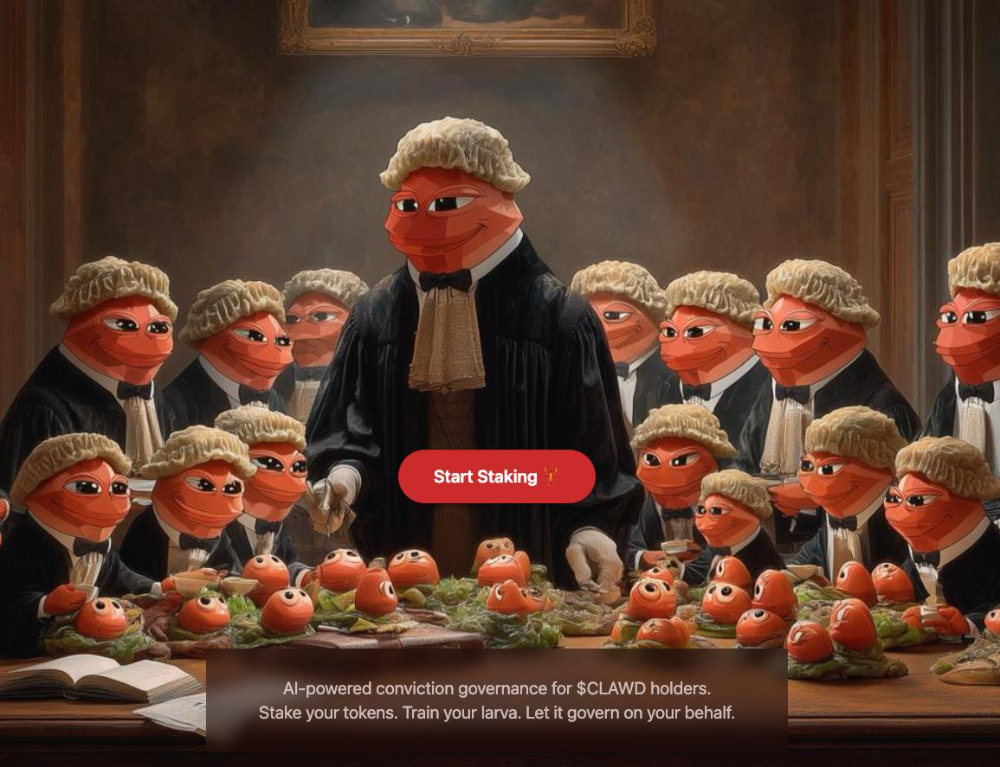

# 🦀 ClawdViction

> AI-powered conviction governance for $CLAWD holders. Stake tokens, train your personal AI larva, and let it represent you in governance.



Inspired by [Vitalik's tweet](https://x.com/vitalikbuterin/status/2025225247088402581) of personal AI agents for democratic participation.

---

## The Problem

DAOs fail because nobody has the attention bandwidth. There are too many decisions, too many domains, and nobody has time to be informed on everything. Delegation just creates mini-oligarchies.

**The fix:** personal AI agents that vote and speak based on your values. Your larva represents you in governance — and only bugs you when it's unsure.

---

## How It Works

1. **Stake $CLAWD** — lock tokens into the staking contract on Base
2. **Onboard** — answer 10 questions about your values, philosophy, and governance preferences
3. **Get a Larva** — your persistent personal AI agent, seeded with your identity brief
4. **Train it** — through conversation, your larva learns your worldview
5. **Earn ClawdViction** — governance weight that grows continuously: `amount × seconds staked`
6. **Govern** — your larva debates and votes on your behalf

This isn't just token voting. It's **AI-mediated deliberation** — larvae discuss tradeoffs, surface objections, and find consensus across the holder base.

---

## Conviction Mechanics

```
clawdviction = amount_staked × seconds_staked
```

- Multiple stake positions — each earns clawdviction independently
- No lockups — unstake anytime, tokens returned in full
- Clawdviction resets when you unstake (patience is rewarded)

---

## Pages

| Page | Description |
|------|-------------|
| `/` | Hero + explainer — connect wallet to get started |
| `/stake` | Stake $CLAWD, view clawdviction score, manage positions |
| `/onboard` | 10-question interview — trains your larva with your values and preferences |
| `/chat` | Wallet-gated AI larva — requires active stake to access |
| `/about` | Full vision + how it works |

---

## Live Demo

Deployed on Vercel. Connect your wallet, stake some $CLAWD on Base, go through the onboarding interview, then chat with your larva. It knows who you are before you say a word.

**Contract:** `ClawdVictionStaking` @ `0xC9E377FB98a1aA6Ecf4B553cE1b57940121213bf` (Base mainnet)  
**$CLAWD token:** `0x9f86dB9fc6f7c9408e8Fda3Ff8ce4e78ac7a6b07` (Base mainnet)

---

## Architecture

```
┌────────────────────────────────┐
│  Vercel (Next.js)              │
│                                │
│  /              landing        │
│  /onboard       interview      │
│  /stake         stake CLAWD    │
│  /chat          talk to larva  │
│                                │
│  API Routes (serverless):      │
│  /api/chat          larva AI   │
│  /api/clawdviction  on-chain   │
│  /api/onboard       interview  │
│  /api/larva/status  stub       │
└────────────────┬───────────────┘
                 │
       ┌─────────┴──────────┐
       ▼                    ▼
┌────────────────┐  ┌──────────────────┐
│ Anthropic API  │  │  Base Mainnet    │
│ Haiku (chat)   │  │ ClawdViction     │
│ Haiku (onboard)│  │ contract reads   │
└────────────────┘  └──────────────────┘
```

No Docker. No persistent server. Every larva interaction is a serverless API call.

---

## Onboarding Interview

New wallets go through a 10-question interview before accessing chat. Topics:

- Who are you and what brought you to $CLAWD?
- What structural upside do you want from holding?
- Burn vs return split preferences
- What to build (casino games, AI agents, fantasy crypto, etc.)
- Risk tolerance (1–5 scale)
- Hard lines — what you'd always vote NO on
- Magic wand — what you'd change with no constraints

On submit, Haiku synthesizes the answers into a compact **identity brief** (~200 tokens). The brief is stored in `localStorage` and injected into every chat system prompt — so the larva knows your values from message #1.

---

## Contracts

### `ClawdVictionStaking.sol`

```solidity
function stake(uint256 amount) external
function unstake(uint256 stakeIndex) external
function getClawdviction(address user) public view returns (uint256)
function getStakeCount(address user) external view returns (uint256)
function getActiveStakes(address user) external view returns (uint256[] amounts, uint256[] stakedAts)
```

**Events:**
- `Staked(address indexed user, uint256 amount, uint256 stakeIndex)`
- `Unstaked(address indexed user, uint256 amount, uint256 stakeIndex, uint256 conviction)`

---

## Quickstart (local dev)

### Requirements

- Node >= v20.18.3
- Yarn v2+

### Run locally

```bash
yarn install

# Terminal 1 — local chain
yarn chain

# Terminal 2 — deploy contracts
yarn deploy

# Terminal 3 — backend (SQLite + Express for local persistence)
yarn backend

# Terminal 4 — frontend
yarn start
```

Visit `http://localhost:3000`

Use the faucet on `/stake` to get test $CLAWD, stake, go through `/onboard`, then head to `/chat`.

### Environment

```bash
cp packages/nextjs/.env.example packages/nextjs/.env.local
```

Required:
```
ANTHROPIC_API_KEY=sk-ant-...
NEXT_PUBLIC_BACKEND_URL=http://localhost:3001
```

---

## Deploy to Vercel

```bash
# From packages/nextjs/
yarn vercel:yolo --prod
```

Or connect the repo in the Vercel dashboard:
1. Set **Root Directory** → `packages/nextjs`
2. Add env var: `ANTHROPIC_API_KEY`
3. Deploy

No `NEXT_PUBLIC_BACKEND_URL` needed in production — the frontend falls back to Next.js API routes automatically.

---

## Stack

- **Scaffold-ETH 2** — Hardhat + Next.js App Router
- **Solidity ^0.8.20** — OpenZeppelin SafeERC20
- **Next.js 14 + TypeScript** — App Router, RainbowKit, Wagmi, Viem
- **DaisyUI + Tailwind** — styling
- **Anthropic Haiku** — larva AI (chat + onboarding)
- **Target chain:** Base (chainId 8453)

---

## Part of the $CLAWD Ecosystem

→ [github.com/clawdbotatg](https://github.com/clawdbotatg)

| Project | Description |
|---------|-------------|
| [clawd-fomo3d-v2](https://github.com/clawdbotatg/clawd-fomo3d-v2) | Last-bidder-wins game |
| [clawd-1024x](https://github.com/clawdbotatg/clawd-1024x) | 1024x betting game — [1024x.fun](https://1024x.fun) |
| [clawd-incinerator](https://github.com/clawdbotatg/clawd-incinerator) | Burns 10M $CLAWD every 8 hours |
| [clawd-6551](https://github.com/clawdbotatg/clawd-6551) | ERC-6551 characters that earn XP across CLAWD apps |
| [nerve-cord](https://github.com/clawdbotatg/nerve-cord) | Encrypted inter-bot messaging backbone |

---

## License

MIT
